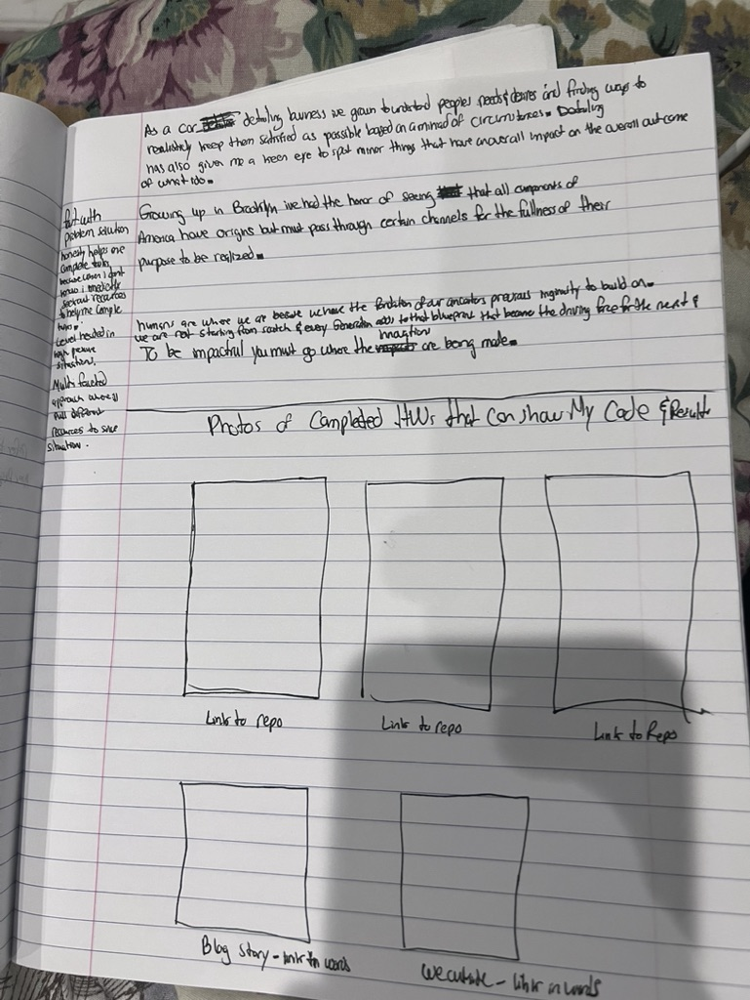

# portfolio
https://shavon63.github.io/portfolio/

#### Technologies used 
I used css and html with Javascript. in java there was a neccessity to make buttons to change the pages of my portfolio. it was also neccessary to download other fonts from google to be added to the portfolio. also i used a animation technology in the css to make the words of my fonts flicker.

##### installation instructions 
first I had to add my css file name to the html with rel=stylesheet and href=style.css. i then had to hook up my java by adding scripts tags and adding app.js to its src.

#### User Stories: im a recruiting manager at google and ive been looking through linked in for two weeks to find a qualified candidtae to fit our open position. weve stumbled apon your portfolio and liked the layout and design. we also thought by way of your about me and resume that you'd be perfect for this position. Most people who come to my portfolio will be looking for someone to filla position in their company or maybe even someone to do some freelancing work for them.

#### wireFrame

#### hurdles i faced
i think my major problem is implementing beautiful design into my program. another problem i faced is detachting the H1s from the nav buttons. for some reason everywhere i tryied moving the headings vertically, the nav would follow.